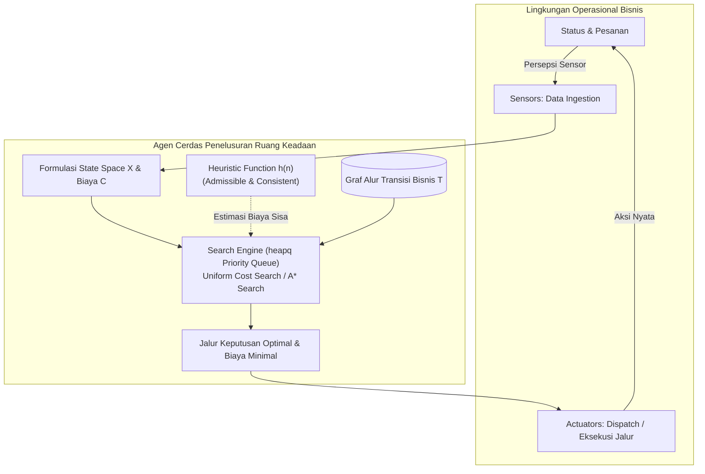

# Proyek Kecerdasan Buatan - Milestone 1
> **Mata Kuliah:** 10S3001 - Kecerdasan Buatan (+P)  
> **Institusi:** Institut Teknologi Del - Sarjana Sistem Informasi  
> **Tugas:** Milestone 1 (W02) - *Business Problem Framing, Spesifikasi PEAS, & Inisialisasi Repositori GitHub*

---

## 📌 Deskripsi Proyek
Repositori ini merupakan implementasi dan serahan Milestone 1 untuk perancangan agen cerdas berbasis penelusuran status (*state-space search agent*) pada domain operasional bisnis nyata. Proyek ini mencakup:
1. **Business Problem Framing:** Profil organisasi, analisis *pain points* operasional, serta justifikasi kebutuhan solusi berbasis AI.
2. **Spesifikasi Formal PEAS:** Pemodelan kuantitatif *Performance Measure*, klasifikasi 6 dimensi *Environment*, daftar *Actuators*, dan instrumen *Sensors*.
3. **Formulasi Ruang Keadaan & Algoritma Penelusuran:** Pemodelan 5-tupel $(X, A, T, G, C)$ dan implementasi algoritma pencarian optimal (*Uniform Cost Search* / *A\* Search*) dengan struktur data antrean prioritas berbasis `heapq`.
4. **Standar Rekayasa Perangkat Lunak:** Manajemen dependensi modern menggunakan Astral `uv`, pengujian otomatis berbasis `pytest`, dan lisensi open-source MIT.

---

## 👥 Tim Pengembang & Distribusi Kontribusi

| Nama Anggota | NIM | Peran / Fokus Tanggung Jawab | Area Kontribusi Utama |
| :--- | :---: | :--- | :--- |
| *Nama Anggota 1* | *NIM Anggota 1* | **AI Solutions Architect & Business Analyst** | `docs/problem_framing.md`, `docs/peas_specification.md`, Laporan Bab 1 & 2 |
| **Boy Harendy** | *NIM Anggota 2* | **Algorithm & Data Modeling Engineer** | `src/graph_model.py`, `src/search.py`, `src/heuristics.py`, Laporan Bab 3 |
| *Nama Anggota 3* | *NIM Anggota 3* | **DevOps, QA & Documentation Lead** | Inisialisasi Astral `uv`, `tests/test_search.py`, `README.md`, Laporan Bab 4 & Kompilasi PDF |

---

## 🏗️ Struktur Repositori

```text
certan-milestone-1/
├── .github/                    # Konfigurasi GitHub & workflow
├── docs/                       # Dokumentasi analisis bisnis & spesifikasi PEAS
│   ├── problem_framing.md      # [Anggota 1] Profil bisnis, alur proses, pain points
│   └── peas_specification.md   # [Anggota 1] Matriks PEAS & 6 dimensi lingkungan operasional
├── src/                        # Kode sumber algoritma & pemodelan graf
│   ├── __init__.py             # [Anggota 2] Inisialisasi package Python
│   ├── graph_model.py          # [Anggota 2] Formulasi X, A, T, G, C & struktur graf bisnis
│   ├── search.py               # [Anggota 2] Engine penelusuran optimal (heapq UCS / A*)
│   └── heuristics.py           # [Anggota 2] Fungsi heuristik admissible & konsisten
├── tests/                      # Pengujian otomatis (Unit Testing)
│   ├── __init__.py             # [Anggota 3] Inisialisasi package tests
│   └── test_search.py          # [Anggota 3] Test cases pytest untuk validasi algoritma
├── .gitignore                  # Berkas yang diabaikan git
├── .python-version             # Versi Python yang dipin (Python 3.11+)
├── LICENSE                     # Lisensi open-source (MIT License)
├── pyproject.toml              # Definisi proyek & dependensi modern via Astral uv
├── uv.lock                     # Lockfile deterministik untuk dependensi
└── README.md                   # Dokumentasi utama proyek
```

---

## 🏛️ Arsitektur Alur Agen Cerdas



---

## 🚀 Panduan Instalasi & Menjalankan Proyek

Proyek ini menggunakan manajer paket modern **[Astral uv](https://docs.astral.sh/uv/)** untuk eksekusi yang cepat, terisolasi, dan deterministik.

### 1. Prasyarat
- Git terpasang di sistem
- Astral `uv` terpasang (Instalasi cepat: `powershell -ExecutionPolicy ByPass -c "irm https://astral.sh/uv/install.ps1 | iex"` di Windows atau `curl -LsSf https://astral.sh/uv/install.sh | sh` di Linux/macOS)

### 2. Kloning Repositori
```bash
git clone https://github.com/boyharendy/certan-milestone-1.git
cd certan-milestone-1
```

### 3. Sinkronisasi Virtual Environment & Dependensi
Cukup jalankan perintah berikut untuk mengunduh dan menyiapkan virtual environment otomatis:
```bash
uv sync
```

### 4. Menjalankan Algoritma Penelusuran
```bash
uv run python -m src.search
```

### 5. Menjalankan Pengujian Unit (*Pytest*)
Untuk memvalidasi kebenaran algoritma, ketiadaan siklus, dan optimalitas biaya:
```bash
uv run pytest -v
```

---

## 📄 Lisensi
Didistribusikan di bawah lisensi MIT. Lihat berkas [LICENSE](LICENSE) untuk informasi lebih lanjut.
