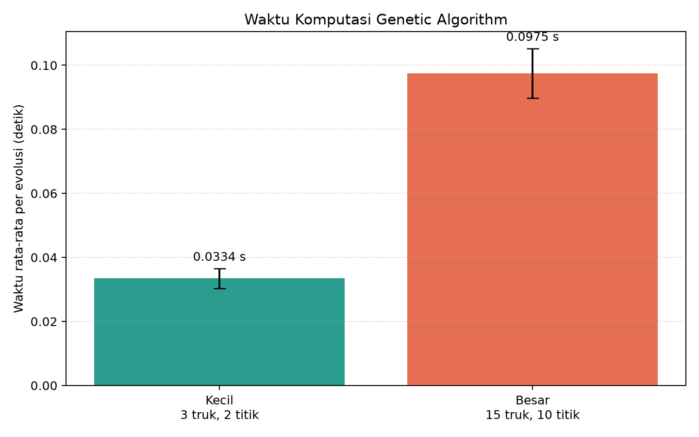
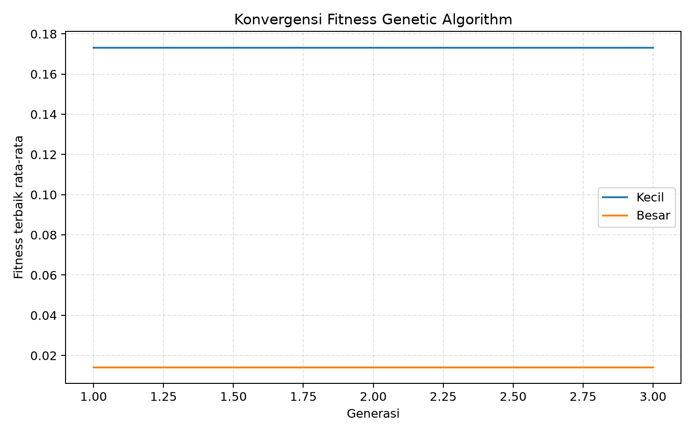

# Perancangan Sistem Rekomendasi Rute dan Alokasi Armada Evakuasi Tsunami Berbasis Agen Cerdas di BPBD Kota Banda Aceh

Repositori ini mengembangkan prototipe sistem pendukung keputusan evakuasi tsunami untuk BPBD Kota Banda Aceh. Milestone 1 memodelkan jaringan evakuasi sebagai graf dan membandingkan Uniform Cost Search (UCS) dengan A*; Milestone 2 menambahkan Genetic Algorithm (GA) untuk menguji alokasi titik bahaya kepada armada dan shelter berdasarkan matriks waktu tempuh.

## Tim Pengembang

| NIM | Nama | Tanggung jawab utama |
| --- | --- | --- |
| 12S24010 | Artha Liebe Siregar | Integrasi data spasial dan visualisasi peta |
| 12S24016 | Boy Harendy Simamora | Model graf, pencarian, dan solver GA |
| 12S24044 | Dianita Lorensia Br Ginting | Pengujian, benchmark, dokumentasi, dan laporan |

## Latar Belakang (Background)

Banda Aceh memiliki wilayah pesisir yang berisiko terhadap tsunami. Dalam situasi darurat, keputusan rute evakuasi perlu mempertimbangkan jarak, risiko jalur, kemacetan, kondisi jalan, serta ketersediaan shelter. Rute terpendek secara geografis belum tentu menjadi rute dengan biaya operasional dan risiko paling rendah.

Proyek ini dibuat sebagai prototipe agen cerdas untuk membantu proses rekomendasi rute evakuasi. Ruang masalah direpresentasikan sebagai graf yang berisi titik bahaya, persimpangan, dan shelter evakuasi. Setiap ruas jalan memiliki bobot biaya yang menggabungkan jarak fisik, faktor risiko, dan faktor kemacetan.

Tujuan proyek:

- Menemukan rute berbiaya minimum pada model graf Milestone 1.
- Menguji alokasi titik bahaya ke armada dan shelter dengan batas kapasitas serta waktu.
- Membandingkan UCS dan A* serta mengukur waktu dan konvergensi GA.
- Menyediakan test otomatis dan visualisasi sebagai bukti evaluasi prototipe.

Hasil proyek merupakan prototipe akademik, bukan rekomendasi operasional siap pakai. Sistem belum terhubung dengan feed real-time BPBD/BMKG, GPS warga, sensor lalu lintas, atau status okupansi shelter.

## Ringkasan Model PEAS

| Unsur | Ringkasan |
| --- | --- |
| **Ukuran kinerja** | Waktu dan jarak evakuasi, risiko jalur, ketepatan waktu mencapai shelter, dan distribusi beban. |
| **Lingkungan** | Jaringan jalan Banda Aceh, titik bahaya, kondisi jalur, kepadatan, peringatan tsunami, dan shelter. |
| **Aktuator** | Menampilkan rute, memperbarui rekomendasi, menandai jalur tidak aman, dan memberi peringatan kepada petugas. |
| **Sensor** | Lokasi/GPS, laporan kondisi jalan, kepadatan, informasi BMKG, dan kapasitas atau okupansi shelter. |

Lingkungan operasional yang dituju bersifat partially observable, stochastic, sequential, dynamic, discrete, dan multi-agent. Implementasi yang tersedia belum mengakses semua sensor tersebut secara langsung.

## Arsitektur dan Penjelasan Kode (Code Explanation)

### Struktur Proyek

```text
T01_Milestone1_Problem_Framing_PEAS/
├── docs/
│   ├── peas_specification.md       # Matriks PEAS dan karakteristik lingkungan
│   ├── problem_framing.md          # Konteks bisnis dan analisis masalah
│   └── Grup18-Tugas02.md           # Naskah laporan Milestone 2
├── data/
│   ├── distance_matrix.json        # Matriks waktu/jarak bahaya ke shelter
│   └── banda_aceh_drive.meta.json  # Metadata cakupan cache graf jalan
├── output/                         # PNG hasil visualisasi
│   ├── benchmark_results.json      # Ringkasan eksperimen GA
│   ├── benchmark_runtime.png       # Grafik waktu komputasi GA
│   └── benchmark_convergence.png   # Grafik konvergensi GA
├── src/
│   ├── benchmark.py                # Benchmark GA skala kecil dan besar
│   ├── data_loader.py              # Matriks jarak/waktu berbasis graf jalan
│   ├── ga_solver.py                # Solver Genetic Algorithm untuk alokasi
│   ├── graph_model.py              # Model node, edge, dan graf evakuasi
│   ├── heuristics.py               # Heuristik Euclidean untuk A*
│   ├── search.py                   # UCS, A*, dan benchmark rute
│   ├── visualize_map.py            # Visualisasi peta dan rute GA
│   └── visualize.py                # Pembuatan peta dan grafik kinerja
├── tests/
│   ├── test_data_loader.py         # Pengujian matriks dan visualisasi peta
│   ├── test_search.py              # Pengujian model, heuristik, dan pencarian
│   └── test_solver.py              # Pengujian operator dan fitness GA
├── cache/                          # Cache respons data, bila digunakan
├── pyproject.toml                  # Metadata proyek dan dependensi
├── uv.lock                         # Versi dependensi yang terkunci
├── run_ai.py                       # Demo layanan AI opsional
└── README.md
```

### Model Ruang Keadaan

`EvacuationGraph` menyediakan antarmuka formal lima komponen ruang keadaan:

| Komponen | Implementasi | Keterangan |
| --- | --- | --- |
| `X` | `state_space` | Seluruh ID node yang terdaftar pada graf |
| `A` | `get_actions(state)` | Node tetangga yang dapat dicapai dari state saat ini |
| `T` | `transition(state, action)` | Transisi deterministik menuju node tujuan |
| `G` | `is_goal(state)` | True apabila state merupakan shelter |
| `C` | `get_step_cost(origin, destination)` | Biaya perpindahan pada satu ruas jalan |

Node menyimpan koordinat lokal, tipe lokasi, kapasitas shelter, dan deskripsi. Edge menyimpan jarak, faktor risiko, faktor kemacetan, dan status dapat dilalui. Biaya satu langkah dihitung dengan rumus:

```text
C(u, v) = distance_km * (1 + risk_factor) * (1 + congestion_factor)
```

Edge yang tidak dapat dilalui memiliki biaya tak hingga dan tidak dikembalikan sebagai aksi valid.

### Data Spasial dan Matriks Jarak

`src/data_loader.py` memuat graf jalan berkendara dari cache GraphML bila cakupannya sesuai, atau meminta jaringan jalan melalui OSMnx. Untuk setiap titik bahaya, fungsi menghitung rute terpendek ke shelter menggunakan Dijkstra berbobot `travel_time`; jarak jalan dihitung dari panjang edge pada rute. Faktor kemacetan dapat mengalikan waktu, dan closure dapat menghapus node sekitar lokasi gangguan sehingga pasangan yang tidak terhubung menghasilkan `inf`.

Jika graf jalan tidak dapat dimuat dan `allow_fallback=True`, data loader dapat memakai estimasi haversine dengan faktor kelikuasan dan kecepatan rata-rata yang ditetapkan. Nilai fallback adalah estimasi garis lurus yang disesuaikan, bukan waktu perjalanan OSM. Untuk hasil yang akan diklaim sebagai data jalan, pastikan JSON menunjukkan sumber `osm` dan verifikasi koordinat/demand/kapasitas dari sumber yang dapat dipercaya.

`src/visualize_map.py` menggambar geometri edge/rute OSM bila graf tersedia. Dalam mode fallback, visualisasi memakai garis lurus dan menampilkan keterangan fallback.

### Algoritma Pencarian

`src/search.py` menggunakan `heapq` sebagai priority queue.

- **UCS** memilih node dengan akumulasi biaya `g(n)` paling kecil. Pada graf dengan bobot positif, algoritma ini menjamin rute optimal.
- **A*** memilih node berdasarkan `f(n) = g(n) + h(n)`, dengan `g(n)` sebagai biaya aktual dan `h(n)` sebagai estimasi menuju shelter.
- `closest_shelter_heuristic` menggunakan jarak Euclidean minimum dari node ke shelter terdekat. Karena biaya ruas tidak lebih kecil daripada jarak fisik, heuristik ini digunakan sebagai lower bound.
- `SearchResult` mengembalikan rute, shelter tujuan, biaya total, jumlah node yang diekspansi, urutan ekspansi, dan waktu eksekusi.

Implementasi menggunakan pemeriksaan biaya terbaik (`best_costs` atau `best_g_costs`) untuk melewati entri priority queue yang sudah tidak optimal. Counter tambahan digunakan sebagai tie-breaker agar entri dengan prioritas sama tetap dapat diurutkan secara deterministik.

### Optimasi Alokasi dengan Algoritma Genetika

Modul `src/ga_solver.py` mengodekan kromosom sebagai dua bagian: indeks shelter untuk setiap truk, diikuti indeks truk untuk setiap titik bahaya. Dengan $k$ truk dan $n$ titik bahaya, panjang kromosom adalah $k+n$. Kromosom saat ini memilih alokasi truk/shelter, tetapi **belum mengodekan urutan kunjungan**, sehingga solver belum merepresentasikan VRP lengkap.

Untuk truk $t$, total waktu $T_t$ adalah jumlah waktu dari titik bahaya yang ditugaskan ke truk tersebut menuju shelter pilihannya. Fungsi objective dan fitness yang benar-benar digunakan kode adalah:

$$J(x)=T_{total}+T_{max}+P, \qquad F(x)=\frac{1}{J(x)+10^{-6}}$$

Penalti total $P$ menjumlahkan:

- **Kapasitas truk:** 100 poin untuk setiap unit demand yang melebihi kapasitas truk.
- **Batas waktu:** 1.000 poin untuk setiap menit waktu truk yang melebihi 20 menit.
- **Kapasitas shelter:** 50 poin untuk setiap unit demand yang melebihi kapasitas shelter.
- **Jalur tak terjangkau:** fitness minimum `1e-9` saat total waktu tidak terhingga.

GA memakai inisialisasi acak, tournament selection (ukuran maksimum 5 pada benchmark), crossover satu titik (probabilitas 0,8), mutasi per gen (rate 0,1), dan elitisme (2 individu). Elitisme mempertahankan solusi terbaik yang ditemukan, tetapi tidak menjamin optimum global.

### Alur Eksekusi

1. `build_banda_aceh_graph()` membuat node, shelter, dan edge jaringan evakuasi.
2. Algoritma menerima ID titik awal, misalnya `Ulee_Lheue`.
3. Priority queue diinisialisasi dengan titik awal dan biaya nol.
4. Node dengan prioritas terbaik dikeluarkan dan diuji sebagai goal.
5. Tetangga yang dapat dilalui diekspansi, lalu biaya dan path terbaik diperbarui.
6. Proses berhenti saat shelter pertama dikeluarkan dari queue atau queue kosong.
7. Hasil dikemas sebagai `SearchResult` dan ditampilkan dalam format ringkasan.
8. Modul visualisasi menggunakan hasil UCS dan A* untuk menghasilkan tiga file PNG.

Tidak terdapat threading, IPC, atau sinkronisasi antarproses. Eksekusi bersifat sinkron dan deterministik terhadap data graf yang digunakan, sedangkan waktu eksekusi dapat berubah antar-run karena dipengaruhi kondisi mesin.

## Prasyarat dan Cara Menjalankan (Getting Started)

### Prasyarat Sistem

- Windows, Linux, atau macOS.
- Python 3.11 atau lebih baru.
- Git.
- `uv` untuk membuat environment dan memasang dependensi.
- Ruang disk yang cukup untuk environment Python dan dependensi Matplotlib.

Instalasi `uv` pada Windows PowerShell:

```powershell
powershell -ExecutionPolicy ByPass -c "irm https://astral.sh/uv/install.ps1 | iex"
```

### Instalasi Proyek

```powershell
git clone https://github.com/boyharendy/T01_Milestone1_Problem_Framing_PEAS.git
cd T01_Milestone1_Problem_Framing_PEAS
uv sync
```

`uv sync` membuat atau memperbarui `.venv` dan memasang dependensi berdasarkan `pyproject.toml` serta `uv.lock`.

### Menjalankan Rekomendasi Rute

```powershell
uv run python -m src.search
```

Perintah tersebut menjalankan empat skenario titik bahaya: `Ulee_Lheue`, `Lampulo`, `Peunayong`, dan `Cut_Mutia`, kemudian membandingkan UCS dengan A*.

Alternatif untuk menjalankan file secara langsung:

```powershell
uv run python src/search.py
```

### Menghasilkan Visualisasi

```powershell
uv run python -m src.visualize
```

Perintah tersebut membuat atau memperbarui:

- `output/peta_jaringan_evakuasi.png`
- `output/skenario_rute_evakuasi.png`
- `output/perbandingan_kinerja_ucs_vs_astar.png`

Untuk visualisasi rute berdasarkan geometri OpenStreetMap, data loader menyediakan `plot_assignments()` dan `plot_truck_routes()` pada `src/visualize_map.py`. Perintah berikut menghasilkan peta rute default (memerlukan graf OSM/cache atau menjalankan fallback garis lurus):

```powershell
uv run python -m src.visualize_map
```

Output default disimpan sebagai `output/peta_rute_riil.png`. Jika data loader memakai fallback haversine, peta akan menampilkan garis lurus dan bukan geometri jalan aktual.

### Menjalankan Pengujian

```powershell
uv run pytest -v
```

Pengujian mencakup model graf, rumus biaya, goal test, admissibility dan konsistensi heuristik, optimalitas UCS dan A*, data loader, serta operator, penalti, dan edge case solver GA.

### Menjalankan Benchmark Genetic Algorithm

```powershell
uv run python -m src.benchmark
```

Benchmark memakai seed awal `42` (seed berikutnya digunakan pada pengulangan selanjutnya), populasi `50`, `50` generasi, kapasitas truk `600`, dan tiga pengulangan per skenario. Untuk uji cepat, opsi dapat diperkecil:

```powershell
uv run python -m src.benchmark --repeats 1 --population-size 8 --generations 3
```

Hasil disimpan sebagai `output/benchmark_results.json`, `output/benchmark_runtime.png`, dan `output/benchmark_convergence.png`. Skenario besar memerlukan 10 titik bahaya, sedangkan matriks sumber saat ini berisi 4; benchmark menambahkan 6 baris sintetis yang ditandai pada JSON.

### Menjalankan Demo Layanan AI Opsional

```powershell
uv run python run_ai.py
```

Demo dapat berjalan dalam mode tanpa API key. Untuk mode Gemini, buat file `.env` berdasarkan `.env.example` dan isi API key sesuai konfigurasi layanan yang digunakan. Jangan commit file `.env` atau API key ke repositori.

## Hasil Eksekusi (Results)

Contoh hasil pengujian:

```text
============================= test session starts =============================
collected 35 items

tests/test_search.py::TestGraphModel::test_state_space_and_shelters PASSED
tests/test_search.py::TestHeuristics::test_heuristic_admissibility_all_nodes PASSED
tests/test_search.py::TestSearchAlgorithms::test_search_optimality_and_equivalence[Ulee_Lheue] PASSED
...
tests/test_search.py::TestSearchAlgorithms::test_edge_case_isolated_node PASSED

============================= 35 passed ================================
```

Setiap `PASSED` menunjukkan satu skenario valid. Pengujian optimalitas memastikan biaya rute UCS dan A* setara, sedangkan pengujian heuristik memastikan nilai estimasi tidak melebihi biaya optimal pada graf uji.

Contoh ringkasan keluaran pencarian:

```text
[A* Search (A-Star)] Ulee_Lheue -> Escape_Building_Lambung
  - Rute Evakuasi      : Ulee_Lheue -> Lambung_Junction -> Escape_Building_Lambung
  - Total Biaya Riil   : 3.8400
  - Simpul Diekspansi  : 4 simpul
  - Waktu Eksekusi     : 0.0xx ms
```

Biaya total adalah akumulasi biaya operasional setiap edge, bukan jarak fisik semata. Jumlah simpul yang diekspansi digunakan untuk membandingkan efisiensi pencarian; waktu eksekusi bersifat informatif dan dapat berbeda pada setiap komputer.

Visualisasi menyajikan node bahaya, persimpangan, shelter, edge jaringan, rute A*, dan perbandingan jumlah ekspansi UCS terhadap A*. File PNG pada `output/` dapat digunakan dalam laporan atau presentasi.

Hasil pencarian Milestone 1 pada graf model:

| Titik bahaya | Shelter tujuan | Jarak | Biaya | Ekspansi UCS | Ekspansi A* | Penghematan ekspansi A* |
| --- | --- | ---: | ---: | ---: | ---: | ---: |
| Ulee Lheue | TES Lambung | 1,80 km | 3,8400 | 4 | 4 | 0,0% |
| Lampulo | Museum Tsunami | 5,40 km | 10,3080 | 6 | 6 | 0,0% |
| Peunayong | Museum Tsunami | 3,20 km | 6,2930 | 6 | 5 | 16,7% |
| Cut Mutia | Museum Tsunami | 2,30 km | 4,2770 | 4 | 3 | 25,0% |

Biaya UCS dan A* sama pada keempat skenario, sedangkan A* mengurangi ekspansi pada dua skenario. Hasil ini berasal dari graf Milestone 1 dan tidak boleh dicampur dengan hasil alokasi GA.

### Hasil Benchmark GA

Benchmark dijalankan dengan seed `42` (tiga pengulangan), populasi `50`, `50` generasi, dan kapasitas truk `600`. Waktu adalah rata-rata satu evolusi pada mesin pengujian ini.

| Skenario | Armada | Titik bahaya | Baris sintetis | Waktu rata-rata | Simpangan baku waktu | Fitness terbaik rata-rata |
| --- | ---: | ---: | ---: | ---: | ---: | ---: |
| Kecil | 3 | 2 | 0 | 0,03342 detik | 0,00309 detik | 0,19288780 |
| Besar | 15 | 10 | 6 | 0,09749 detik | 0,00771 detik | 0,03023784 |

Pada skala kecil, fitness terbaik tetap `0,19288780` dari generasi pertama hingga ke-50. Pada skala besar, fitness terbaik rata-rata meningkat dari sekitar `0,00480` pada generasi pertama menjadi `0,03024` pada generasi ke-50. Waktu skala besar sekitar 2,92 kali skala kecil pada mesin pengujian ini. Fitness antarukuran masalah tidak dibandingkan langsung karena jumlah penugasan dan skala fungsi objektif berbeda.

Perbandingan waktu ini bersifat deskriptif: jumlah truk dan jumlah titik bahaya berubah bersamaan, sementara enam baris besar bersifat sintetis. Eksperimen ini tidak mengisolasi dampak satu faktor, tidak mengukur performa produksi, dan tidak membuktikan pengurangan kemacetan lapangan.





### Batasan Data dan Interpretasi

Matriks sumber memiliki empat titik bahaya; karena itu enam baris untuk skenario besar dibangkitkan secara sintetis dari baris sumber dengan variasi kecil. Selain itu, `src/data_loader.py` menandai koordinat, demand, dan kapasitas sebagai placeholder yang perlu diverifikasi terhadap sumber resmi. Hasil benchmark ini mengukur perilaku solver pada input yang tersedia, bukan bukti performa operasional atau akurasi rute untuk 10 lokasi nyata.

Solver GA saat ini mengalokasikan titik bahaya ke truk dan shelter, tetapi tidak merepresentasikan urutan kunjungan dalam kromosom. Waktu rencana dihitung dengan menjumlahkan waktu titik bahaya-ke-shelter; oleh sebab itu, hasil belum mencakup optimasi rute kendaraan lengkap dengan urutan pickup.

## Analisis dan Evaluasi (Review and Future Improvements)

### Evaluasi Implementasi Saat Ini

- **Optimalitas:** UCS menghasilkan rute minimum berdasarkan biaya edge positif. A* menghasilkan biaya yang sama dengan UCS pada pengujian karena menggunakan heuristik admissible.
- **Efisiensi:** A* dapat mengurangi jumlah node yang diekspansi karena prioritasnya diarahkan oleh estimasi jarak ke shelter. Keuntungan aktual bergantung pada bentuk graf dan kualitas heuristik.
- **Kompleksitas:** Dengan priority queue, proses pencarian secara umum memiliki biaya sekitar `O((V + E) log V)` untuk graf berbobot, dengan `V` sebagai jumlah node dan `E` sebagai jumlah edge. Penyimpanan path pada setiap entri queue meningkatkan penggunaan memori dibandingkan menyimpan predecessor saja.
- **Keterbatasan data:** Graf dan bobot saat ini merupakan data pemodelan statis. Sistem belum menerima GPS warga, laporan kerusakan, kepadatan lalu lintas, peringatan BMKG, atau okupansi shelter secara real-time.
- **Keterbatasan model:** Faktor risiko dan kemacetan dirangkum dalam bobot sederhana. Kapasitas shelter belum menjadi constraint pencarian dan belum ada optimasi distribusi banyak kelompok warga.
- **Keterbatasan validasi:** Test suite memvalidasi algoritma dan model, tetapi belum menguji integrasi dengan API eksternal, ketahanan terhadap data sensor yang tidak lengkap, atau performa pada graf skala kota yang besar.

### Pengembangan Berikutnya

1. Integrasikan sumber data real-time untuk status jalan, kepadatan, peringatan tsunami, dan kapasitas shelter.
2. Tambahkan validasi skema input serta penanganan data sensor yang hilang, terlambat, atau tidak konsisten.
3. Gunakan predecessor map untuk mengurangi duplikasi penyimpanan path pada priority queue.
4. Tambahkan constraint kapasitas shelter dan model multi-agent untuk mencegah penumpukan warga pada satu rute.
5. Kembangkan API atau antarmuka peta untuk menampilkan rekomendasi berdasarkan lokasi GPS pengguna.
6. Tambahkan benchmark pada graf yang lebih besar serta continuous integration untuk menjalankan test otomatis pada setiap pull request.
7. Kalibrasikan bobot risiko dan kemacetan menggunakan data historis BPBD agar biaya rute lebih representatif.

## Lisensi

Proyek ini didistribusikan berdasarkan lisensi MIT. Lihat file [LICENSE](LICENSE) untuk detail selengkapnya.
